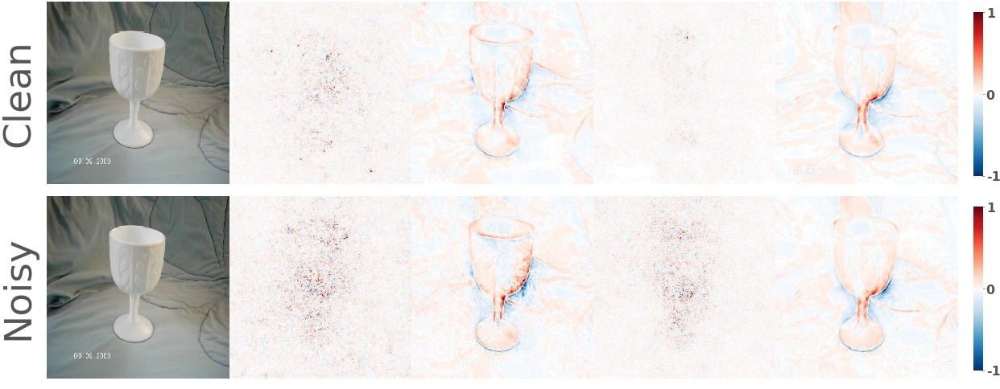

## SAM: The Sensitivity of Attribution Methods to Hyperparameters

This repository contains source code necessary to reproduce some of the main results in [the paper]():

**If you use this software, please consider citing:**
    
    @misc{bansal2020sam,
    title={SAM: The Sensitivity of Attribution Methods to Hyperparameters},
    author={Naman Bansal and Chirag Agarwal and Anh Nguyen},
    year={2020},
    eprint={},
    archivePrefix={CVPR},
    primaryClass={cs.LG}
    
## 1. Setup

### Installing software
This repository is built using PyTorch. You can install the necessary libraries by pip installing the requirements text file `pip install -r ./requirements.txt`

### Pretrained models
All of our experiments were conducted on two groups of classifiers: (a) [GoogLeNet](https://arxiv.org/pdf/1409.4842.pdf) and [ResNet-50](https://arxiv.org/pdf/1512.03385.pdf) pre-trained on the 1000-class 2012 ImageNet dataset; and (b) the robust versions of them, i.e. GoogLeNet-R and ResNet-R that were trained to also be invariant to small adversarial changes in the input image. The two regular models are obtained from the [PyTorch model zoo](https://pytorch.org/docs/stable/torchvision/models.html), the ResNet-R from [Engstrom et al.](https://arxiv.org/pdf/1906.00945.pdf), and we trained GoogLeNet-R by ourselves using the code released by the author. While the two robust classifiers are more invariant to pixel-wise noise they have lower ImageNet validation-set accuracy scores (50.94% and 56.25%) than those of the original GoogLeNet and ResNet (68.86% and 75.59%).
    
#### Adversarial training details
[Engstrom et al.](https://arxiv.org/pdf/1906.00945.pdf) adversarially trained a ResNet-50 model using Projected Gradient Descent (PGD) attack with a normalized step size. We followed the author and trained robust GoogLeNet model, denoted as GoogLeNet-R, for our sensitivity experiments. We used adversarial perturbation in -norm for generating adversarial samples during training. Additionally, we used =3, a step size of 0.5 and the number of steps as 7 for PGD. The model was trained end-to-end for 90 epochs using a batch-size of 256 on 4 Tesla-V100 GPU's. We used SGD optimizer with a learning rate (lr) scheduler starting with lr=0.1 and dropping the learning rate by 10 after every 30 epochs.

All the pre-trained models are available [here](https://drive.google.com/drive/u/2/folders/1KdJ0aK0rPjmowS8Swmzxf8hX6gU5gG2U).

## 2. Usage
- The shell script for generating Figure 1 of our paper is in [teaser.sh](teaser.sh). Given an [image](./Images/teaser/ILSVRC2012_val_00002056.JPEG), the script runs SmoothGrad, Sliding-Patch, LIME, and Meaningful Perturbation algorithm for their different hyperparameters and produces a montage image of their respective [attribution maps](./results/formal_teaser.jpg)

### Examples
Generating the attribution map for the class "matchstick".
Running `source teaser.sh` produces this result:

    

<i> The real image followed by the different attribution maps generated using (top-->bottom) LIME, Sliding-Patch, Meaningful Perturbation and SmoothGrad algorithms. We show the sensitivity (left-->right) of each explanation algorithm with respect to its respective hyperparameter.</i>

- The shell script for generating Figure 2 of our paper is in [gradient.sh](gradient.sh). Given an [image](./Images/grad/ILSVRC2012_val_00020735.JPEG), the script generates the [gradient](./results/formal_gradient.jpg) of four models (GoogLeNet, GoogLeNet-R, ResNet-50, and ResNet-50-R) for a clean and noisy image respectively.

### Examples
Generating the attribution map for the class "goblet".
Running `source gradient.sh` produces this result:

    

<i> The clean image followed by the gradient attribution maps generated using (left-->right) GoogLeNet, GoogLeNet-R, ResNet-50, and ResNet-50-R models. We show the sensitivity of the gradients on adding a small Gaussian noise to the clean image for all the models respectively.</i>

- The shell script for evaluating the sensitivity of different explanation methods is in [sensitivity.sh](sensitivity.sh). The sensitivity is calculated for five sample images in [this](./Images/images_sensitivity/) folder across all four models (GoogLeNet, GoogLeNet-R, ResNet-50, and ResNet-50-R).
Running  `source sensitivity.sh` runs the sensitivity test on Vanilla Gradient (VG), Input x Gradient (IG), Sliding-Patch (SP), Meaningful Perturbation (MP), LIME, and Smooth Gradient (SG) explanation methods on their respective hyperparameters. Given the list of images in the folder, the script calculates the average accuracy scores across all the images using the evaluation metrics described in the paper.

## 3. Licenses
Note that the code in this repository is licensed under MIT License, but, the pre-trained condition models used by the code have their own licenses. Please carefully check them before use. 

## 4. Questions?
If you have questions/suggestions, please feel free to email us or create github issues.
